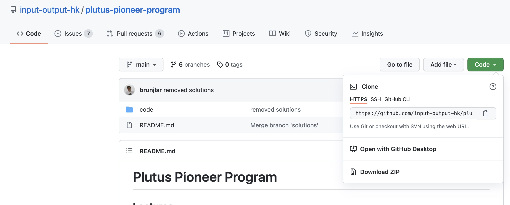
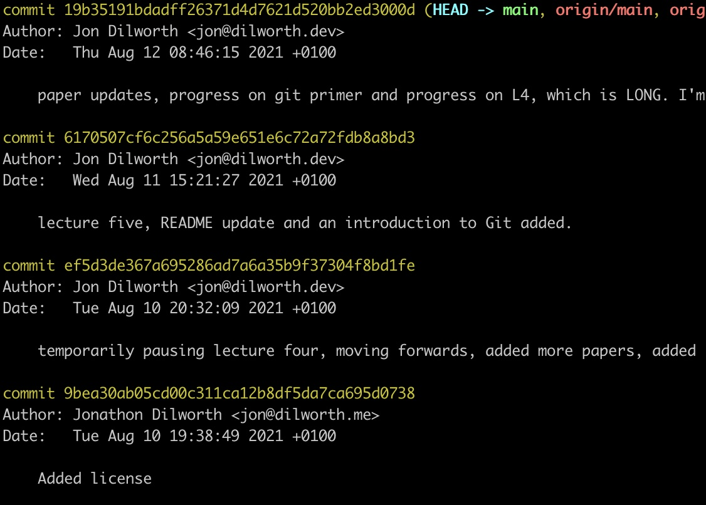

# Git: A Brief Introduction

> "My name is Linus Torvalds and I am your god." <br />
> — Linus Torvalds

For more *interesting* quotes by Linus, see [this wiki page](https://en.wikiquote.org/wiki/Linus_Torvalds).

*Note: Although Linus did put a lot of work into creating one of the most widely adopted, open-source operating systems to date, he didn't do it all by himself! This is where tools that allow teams to effectively work together (such as Git, which is a source code management system) are incredibly valuable. Who do you think designed Git? Linus Torvalds, of course (you know, that guy who started building out Linux). Want to hear more from Linus? See: <https://youtu.be/4XpnKHJAok8>.*

### 1. Introduction

This document is catered towards providing a brief introduction to git, specifically how to use git in combination with GitHub for collaborative purposes. For power users (software engineers and most developers with experience working in teams), this document will likely be of little interest to you.

Git is not necessarily the easiest piece of software to use as a non-technical individual, as such, the structure of this document approaches the domain in a tapered fashion, slowly introducing concepts, basic mechanisms and how to use them.

If you consider yourself to be somewhat technical, but this is your first time working in a team, you may be better off reading the documentation found at <https://git-scm.com/>.

### 2. What Is Git?

Simply put, Git is a source code management system, or a revision control system. The next question you're likely asking yourself is: what is one of those?

**Source code management system** ([from Wikipedia](https://en.wikipedia.org/wiki/Version_control)): In software engineering, version control (also known as revision control, source control, or source code management) is a **class of systems** responsible for **managing changes** to computer programs, **documents**, large websites, or **other collections of information**.

### 3. Should I use Git in my project?

Right, now you know what it is, the question is: should you use it? So, even though the name would suggest that Git is only for managing work produced by teams of software engineers, it **can be (but shouldn't necessarily be)** used in combination with other software to effectively allow many types of teams to collaborate.

**Is Git the right tool for the job?**. For some of you, it will be, for others, it likely won't be. It depends on the job and the people involved. A good rule of thumb (assuming you have the time) would be: **try learning Git** (and we'll get to GitHub), **see how it goes**, then you (and your team) should decide, **is this for me (and my team)?**

### 4. Git: One-oh-One

*Again, the style in which this document is written is supposed to be easier to digest than the terribly boring documentation provided by the collection of neckbeards over at git-scm. But if you happen to like that kind of thing, you'll be better off over there!*

Okay, so you've probably heard of Git, right? You have? Great! You've heard of GitHub too I would imagine? So what's the difference? Well, we could get all technical, but you know how Git is just one piece of software that is used in combination with other pieces of software to enable effective collaboration? Well, GitHub provides some of those additional bits and bobs that make things a lot easier. Whilst we'll typically think of Git and GitHub as 'kind of' the same thing, it's actually important to recognise that they're not. Git is 'the special sauce' that makes collaboration possible, but git by itself really is for quite technical people (and happens to be completely decentralised), whereas GitHub provides a bunch of extra tooling and nice graphical interfaces that make this whole experience of collaboration a lot smoother.

However, one may argue that GitHub promotes a somewhat more centralised model, as the **main 'place'** (known as a **central** repository) where all your files are stored and are most up-to-date exists on GitHub servers. The main takeaway here is: typically people do not use Git in the way that it was originally intended to be used (in a completely decentralised fashion, where people collaborate through a web-of-trust model) - but we're not going to get too technical here. Thus, for the purposes of this article, I am going to do what most (not so great) teachers do when students ask questions and say: don't worry about it, we'll come to that later!

Remember learning Java, and asking about objects 'too early'?

> "So how is this object-orientated? What is an object?"

Teacher:

> "Urrghh, don't worry about that quite yet, we'll cover that a little later."

### 4.1 Basic Git Commands and Repositories

During this section, we are going to run through the very basics of git. Firstly, how to configure a basic git user, downloading (cloning) repositories and find out who has changed what. Along with a bunch of basic commands.

#### 4.2 Git: Simple Configuration

When you contribute to any project, whether it is open source or closed source, it's always important (and polite) to let people know who you actually are (sure, you can remain anonymous, but when you come to do things like submit a patch, it's nice to know who is contributing, it does add a degree of credibility too). This can be accomplished by specifying the settings (your name and your e-mail address) within the console. We do this using the following commands:

1. ```git config --global user.name "Joe Blogs"```
2. ```git config --global user.email "joe@example.com"```

*Note: the addition of the --global flag will set these values for any commits you push, on any project. To keep it project-specific, simply remove the --global flag when specifying these details from within a repository.*

[Read More Here](https://git-scm.com/book/en/v2/Customizing-Git-Git-Configuration)

#### 4.3 Git: Clone

When you copy an open-source Git repository from a centralised service such as GitHub, you won't need explicit access to the repository. You simply navigate to the repo, look for the green button that says: 'clone', select it (it is a drop-down, of sorts) and use either HTTPS or SSH. If in doubt, HTTPS should work just fine. Copy the address provided for you by the drop-down window, open your favourite console, navigate to where you want to clone the repo and enter:

<code>git clone *ADDRESS-GOES-HERE*</code>

You should now have a folder within the directory you're in, that new folder is the repository of the project you just 'cloned' (or, *downloaded*).



[Read More Here](https://git-scm.com/docs/git-clone)

#### 4.4 Git: Log

Configuration variables, such as the ones above can be useful in other ways too. Sometimes it is nice to know who pushed a specific commit, so you can get back to them (not to assign blame, but to ask them about the changes that were made). This is possible by running ```git log``` within the repository.

As you can see from the image below, this provides you with some additional information (the commit hash, branch details, the author name and e-mail, the date, the commit message, you get the idea).



This is helpful because it allows us to easily track who made certain changes.

[Read More Here](https://git-scm.com/docs/git-log)

### 4.5 What Is A Repository?

Up until this point, it has been assumed that you understand the basic concept of a repository (often referred to as a repo). However, there is a little more to a repository than may meet the eye.

It just looks like any other file right? Except it has some fairly special properties (if you run ```ls -a``` within the repo, you'll see a hidden .git folder) which allow for useful functionality.

The original copy of this document gets pretty technical, so let's just put it like this... Repos are great! Why? Because they allow you to go back in time! You know, like back to the future? Ever thought about that name? Back to the future? It's like I can go backwards and forwards in time whenever I like! That's right! But then you run into issues, like what if the changes in the past affect the changes in the future!? Well, then you get this 'branching' phenomenon! You start getting, what would likely be referred to as, 'many worlds' (these are not technical terms, by the way, if you want technical stuff, go over to git-scm).

How do we deal with this? Well, we allow anyone to create their own branch! So now you can go forwards in time, backwards in time and side-ways in time! You can check to see what happened in the past, you can see what people are working on right now (on another branch) and you can see what has happened whilst you've been gone by pulling down the latest changes.

Neat, right!?

*My guess would be, you're not really going to understand this stuff until you actually go and mess about with it.*

If you wanted to just stick with **really basic**, a repository is essentially just a folder that contains shared code, that you can collectively modify under a set of constraints.

[Read More Here](https://git-scm.com/)

#### 4.6 Git: Pull

This is pretty simple actually. Running <code>git pull</code> within a git repo directory will simply pull down the latest contributions everybody has made. It can get a little hairy if you're all an unorganised mess and you're editing the same files. Then you get something called a merge conflict, but don't worry about that quite yet (and that's kind of why we have branches, right? remember those many worlds! Well, they're useful for exactly this reason, they minimise merge conflicts).

[Read More Here](https://git-scm.com/docs/git-pull)

#### 4.7 Git: Add

Again, this is simple and easy to understand. Whenever you change something in your local repo, you can run a command called <code>git status</code> and it shows you which files you've changed, created or deleted. These files need 'adding' to the next commit. So, there are two ways of doing this.

**1. The Cautious Way: one by one**

This is what I do. Why? Well, usually because there are some files I simply do not want to add to the commit yet. However, sometimes other files may have 'found their way' into the local repo and they shouldn't be there. If you've not configured git correctly, you may accidentally upload something by accident (like a secret key in a configuration file, or some dependencies that should be cached locally).

With this said, I would promote setting up git properly, at minimum (if you're working with code, or if you often find .DS_Store files in your repo) add a .gitignore file to the repo. Regardless, you should spot anything wrong when you run ```git status```.

So, the cautious way is adding files one at a time. This is accomplished by running the following command: ```git add [INSERT RELATIVE FILE PATH HERE]```.

**2. The... "Ahhh, everything will be just fine" Method:**

Simply run <code>git add .</code> and all the changes you've made will be appended to your commit. One of the reasons why this may be risky at times is, well, for a number of reasons really. Maybe you accidentally upload a password, a private key, something bloaty or just files that simply do not need to be there.

Again, this is why we use a [.gitignore](https://git-scm.com/docs/gitignore) file. So yeah, maybe just watch out if you're new to this!


[Read More Here](https://git-scm.com/docs/git-add)

#### 4.8 Git: Commit

Once you have added a bunch of new changes using the <code>git add</code> command, you can bundle them together in the form of a commit. A commit will be seen by other individuals when they run <code>git log</code>, they can then checkout to that commit and look at your changes. Alternatively, if they're using GitHub / a centralised method of hosting the repo, it's usually a lot easier to view commits and the changes that you have made. It's made easy through the use of a web GUI. ```git diff``` is also a good method of viewing changes between two commits (often used in resolving merge conflicts). Once again, git diff is made easy through the use of a web GUI provided by GitHub.

Right, so in order to bundle all your changes together, say, at the end of the day, or when you've finished a particular feature, you run the following command: 

```git commit -m "describe what your changes do, not whats changed"```.

*Simple As.*

[Read More Here](https://git-scm.com/docs/git-commit)

#### 4.9 Git: Push

Right, so all your changes are only held on your own computer locally. But what about the rest of the team? They need to see your changes, they also need to pull them into their own copies of the repo. They might need a feature you are responsible for creating in order to move forwards with their work.

Pushing your commits to the central repo is as simple as ```git push``` after having added files and committed them. To be clear, you added or modified files, then you commit, then you push (and it's recommended that perhaps you try pulling before doing any of this in case there are any merge conflicts).

So you've pulled, added and committed, right? Great, go ahead and run:

```git push```

[Read More Here](https://git-scm.com/docs/git-push)

#### 4.10 Git: Branch

If you're working on a project, alone (in a cave, which is discouraged), I wouldn't worry about this too much. But you're likely working in a team, so you may need to change branches, create a new branch, or load an alternative commit.

<code>git branch</code> will show you the available branches.

```git checkout [BRANCH_NAME]``` will change your local working branch to the branch specified within ```[BRANCH_NAME]```. This may change a lot of the files within your local repo, but you can always change back to your own branch.

You can also ```git log```, find an old commit hash and do the same.

[Read More Here: Branch](https://git-scm.com/docs/git-branch)

[Read More Here: Checkout](https://git-scm.com/docs/git-checkout)

#### 5. Git: Extra Reading
<span id="s57"></span>

* [Merging Branches](https://git-scm.com/docs/git-merge)
* [Opening Pull Requests](https://docs.github.com/en/github/collaborating-with-pull-requests/proposing-changes-to-your-work-with-pull-requests/about-pull-requests)
* [Detached Head](https://git-scm.com/docs/git-checkout#_detached_head)
* [Additional Further Reading](https://lab.github.com/)

#### 5.1 Data Structures

According to Wikipedia:

> Git has two data structures: <br />
> 1. A mutable index (also called stage or cache) that caches information about the working directory and the next revision to be committed; and an immutable, append-only object database. <br />
> 2. The index serves as a connection point between the object database and the working tree.

*Note: An immutable, append-only, object database? That sounds familiar, kind of, right?*