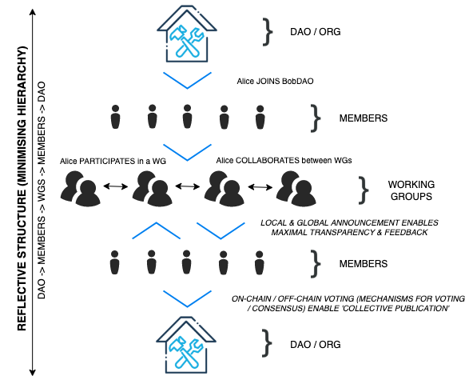

# Guidance for Governance

*Note: opinions expressed herein are those of the author and are not representative of any organisation, nor is this legal advice.*

### 1. Introduction

This document aims to provide a set of guidelines for decentralised autonomous governance models. Within this context, autonomous does not refer to 'powered by smart contracts', rather, it refers to the autonomy exerted by any given member of a DAO [[1]](#ref1) (or DO [[2]](#ref2), or DAC [[3]](#ref3)) and their actions and/or behaviour at the social layer[1](#fn1).

#### 1.1 Through The Authors Experience

The following section (§2) will specify numerous social governance guidelines that could be drawn from to create order within a non-hierarchical, decentralised social structure. These guidelines may or may not work and are simply suggestions made by the author and relate to the direct experience of the author.

### 2. Properties & Processes

#### 2.1. Structure

Understanding how to best work together as an organisation within a distributed, flat model appears to be quite difficult. This is why you do see hierarchies [[4]](#ref4) spontaneously emerge within complex systems (within nature) [[5]](#ref5).

Furthermore, whilst it may also be argued that technological solutions to sociological problems [[6]](#ref6) are difficult to find, I would postulate that such solutions do exist (on-chain governance).

The issue that many 'DAOs' (or cooperatives) face is the structural nature of the organisation as it transitions from being 'off-chain' to 'on-chain'. Although a DAO is usually going to have an 'off-chain' sociological component [[7]](#ref7), operating completely 'off-chain' would seem to open the floodgates for potential conflicts of interest and centralisation. Thus the following properties and processes may be a consideration for adoption.

> For example, many blockchain combine on-chain governance with off-chain elements, such as discussions on forums.  
> — Kiayias, A. and Lazos, P., 2022. [[7]](#ref7)

> Different governing mechanisms exist, depending on the platform. Off-chain governance is the most centralised of such mechanisms with the core developers or the most trusted contributors making most of the decisions.   
> — Kiayias, A. and Lazos, P., 2022. [[7]](#ref7)

#### 2.2. Reflective Social Structure

**Properties include:**

* Maximal Transparency
* Minimisation of Hierarchy
* Power Distribution (or some form thereof)

**Processes include:**

* Joining
* Participating
* Collaborating
* Feedback
* Local Announcement
* Global Announcement
* Collective Publication

#### 2.3. Maximal Transparency

Transparency is maximised, such that anybody within the organisation can see what anybody else is doing, at any time.

#### 2.4. Participation

Whilst participation is not a prerequisite for membership, a participation threshold should be set before a member is given any degree of the voting power.

#### 2.5. Collaboration

Whilst collaboration is not a prerequisite for participation, it should be highly encouraged. Encouraging individuals to work in a collaborative fashion bears benefits [[8]](#ref8) [[9]](#ref9).

> "The primary goal was to discover if synchronous collaboration capability through a particular application improved the ability of the team to form a common mental model of the analysis problem(s) and solution(s). The results indicated that such collaboration capability did improve the formation of common mental models, both in terms of time and quality [...]"  
> — Linebarger, J.M., Scholand, A.J., Ehlen, M.A. and Procopio, M.J. [[8]](#ref8)

#### 2.6. Feedback

The word or phrase used to describe this quality will likely change depending on the culture that the organisation adopts. For instance, if the maintainers of the Linux Kernel were to form a DAO, they may wish to adopt alternative types of feedback that are much more direct and may be considered to be controversial (see: [https://lkml.org/](https://lkml.org/)). Regardless, feedback, peer review and many other types of constructive comments between members are imperative in order to ensure everybody is on the same page. Furthermore, feedback is a great way of accelerating the learning process and improving project progress. Thus, communication is incredibly important.

#### 2.7. Local Announcements

Given the structure specified in (§2.2), a 'local announcement' would be either an individual or a subset of individuals who are collaboratively working together (a working group or a subset therein) announcing their plans and/or work-in-progress to the appropriate working group (and thus, is globally visible given the maximal transparency property).

The reasons as to why 'local announcement' is important:

* Enables maximal transparency (albeit, suboptimally).
* Opens opportunities for additional participation (otherwise known, at this juncture, as collaboration) within the appropriate working group.
* Allows for global or local feedback (from the entire DAO or the working group).

#### 2.8. Global Announcements

Similarly to 'local announcement', global announcement satisfies maximal transparency as the entire DAO should be alerted to a given piece of work that has been completed by a working group. It is at this point that some kind of voting mechanism should be triggered in order to determine whether the piece of work should be:

* Approved
* Opposed
* Archived
* Improved Upon

If a piece of work is approved, it can be allocated to be enacted instantaneously, or at some point in the future.

#### 2.9. Collective Publication

Collective publication is the process by which an approved piece of collaborative work completed by a working group is published by the DAO. Thus, the completed work becomes a product (and is, therefore, representative) of the DAO rather than the internal working group. This is important because it has implications for 'brand reputation' and may affect the value proposition of the DAO itself.

#### 2.10. Issues

**Maximal Transparency**

Effective, intuitive & free tooling that enables maximal transparency at scale is fairly difficult to find. Git does exist and Git is truly decentralised (although, having a central repository on GitHub is moving towards centralisation). However, Git & GitHub may have a steeper learning curve to them than say Miro for effective collaboration. All the tools we have reviewed have their positives and negatives, are mostly centralised (client-server architecture) and do not easily scale.

**Suboptimal Collaboration**

Tooling for effectively (optimally) collaborating in a peer-to-peer fashion within domains other than software development may not exist yet.

**Incentive Mechanisms**

Effectively getting individuals to participate and collaborate. Economic self-interest (whilst important insofar as money is a requirement to live) is not the most effective method of maximising performance or encouraging engagement.

**Communication Issues**

As an example, text can be misleading. People have a tendency to (on occasion) misinterpret the intent of others when reading messages sent as text via a service such as discord.

#### 2.11. Potential Solutions

*TODO: FINISH SECTION*

### 3. True Governance

*TODO: Add section introduction.*

*TODO: Add subsections.*

*See: Video by Robert.*

*See: SoK paper.*

*TODO: FINISH SECTION*

### References

<a href="#ref1" id="ref1">[1]</a>. Sims, A., 2019.  
Blockchain and Decentralised Autonomous Organisations (DAOs): The Evolution of Companies?   
New Zealand Universities Law Review 423-458

<a href="#ref2" id="ref2">[2]</a>. V, Buterin., 2014.   
DAOs, DACs, DAs and More: An Incomplete Terminology Guide.  
ETH Foundation Blog. Research & Development: <https://blog.ethereum.org/2014/05/06/daos-dacs-das-and-more-an-incomplete-terminology-guide/>   
Accessed: 5th February 2022.

<a href="#ref3" id="ref3">[3]</a>. P, Kershaw., 2018.  
Decentralised Autonomous Co-Operative’s (DAC) and The Rise Of The New ‘Commons’.  
Published by Medium: <https://medium.com/coinmonks/decentralised-autonomous-co-operatives-dac-and-the-rise-of-the-new-commons-721f5e1a7d3>  
Accessed: 5th February 2022.

<a href="#ref4" id="ref4">[4]</a>. Hill, R.A., Bentley, R.A. and Dunbar, R.I., 2008.   
Network scaling reveals consistent fractal pattern in hierarchical mammalian societies.    
Biology letters, 4(6), pp.748-751.

<a href="#ref5" id="ref5">[5]</a>. N, Shrimpo., 2021.   
Scaling a DAO: representation and hierarchy.    
Reddit.com/r/dao: <https://www.reddit.com/r/dao/comments/ogxt2f/scaling_a_dao_representation_and_hierarchy/>    
Accessed: 5th February 2022.

<a href="#ref6" id="ref6">[6]</a>. B, Fitzpatrick., B. Collins-Sussman., 2009.   
The Myth of the Genius Programmer.   
Google I/O / Google Developers Tech Talk.   
<https://youtu.be/0SARbwvhupQ?t=1345>
Accessed: 5th February 2022.

<a href="#ref7" id="ref7">[7]</a>. Kiayias, A. and Lazos, P., 2022.  
SoK: Blockchain Governance.  
arXiv preprint arXiv:2201.07188.

<a href="#ref8" id="ref8">[8]</a>. Linebarger, J.M., Scholand, A.J., Ehlen, M.A. and Procopio, M.J., 2005, November.    
Benefits of synchronous collaboration support for an application-centered analysis team working on complex problems: a case study.    
In Proceedings of the 2005 international ACM SIGGROUP conference on Supporting group work (pp. 51-60).

<a href="#ref9" id="ref9">[9]</a>. Green, B.N. and Johnson, C.D., 2015.   
Interprofessional collaboration in research, education, and clinical practice: working together for a better future.     
Journal of Chiropractic Education, 29(1), pp.1-10.

### Footnotes

*TODO: FINISH SECTION*